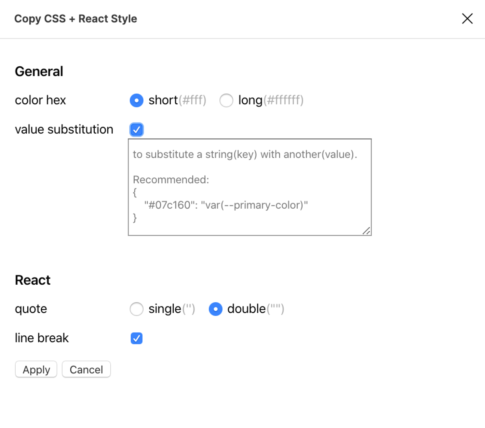

# Copy CSS + React Style

Copy CSS style or React inline style from a selected layer in Figma.

## What's the difference from coping CSS in the right inspection panel?
1. irrelevant absolute positions and comments removed.
2. export raw CSS style or React inline style.
3. custom style, such as single or double quotes, 6 digit hex color(#ffffff) or 3 digit(#fff).
4. custom CSS Variables substitution.

All the custom options can be found in the 'setting' menu.
More options will be supported soon.

